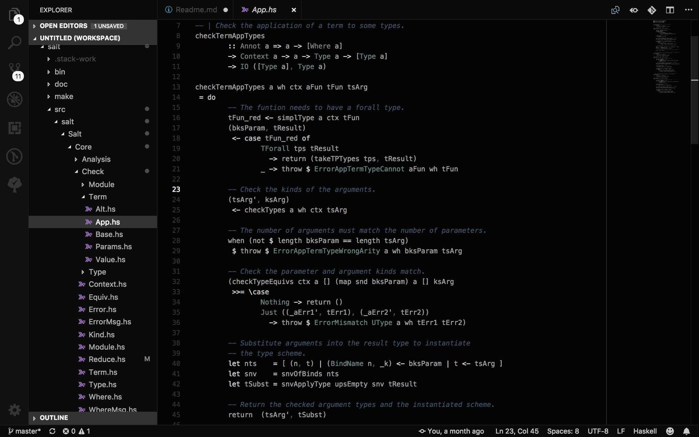

# Salt Plain Visual Studio Code Theme

A minimal dark theme with a slight chroma, fixed to work well with the Haskell and Salt language extensions.

Based on the mno (monochrome) theme by `u29dc/mno` available from https://github.com/u29dc/mno.

If you're hacking Salt then you may also want the matching [Visual Studio Code Language Extension](https://github.com/discus-lang/salt-vscode).

