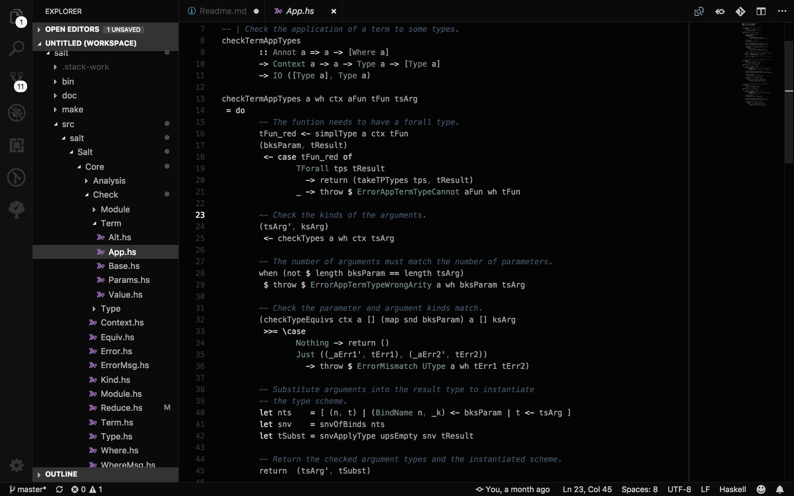

# Salt Plain Theme

Minimal dark theme with a slight chroma, fixed to work well with the Haskell and Salt language extensions.

These were based on the mno (monochrome) theme by `u29dc/mno` available from https://github.com/u29dc/mno.

