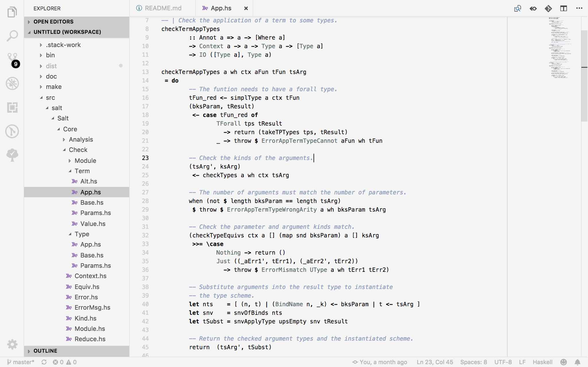

# Salt Plain Visual Studio Code Theme

Minimal light and dark themes with chroma on content only, fixed to work well with the Haskell and Salt language extensions.

Thes are based on the mno (monochrome) themes by `u29dc/mno` available from https://github.com/u29dc/mno.

If you're hacking Salt then you may also want the matching [Visual Studio Code Language Extension](https://github.com/discus-lang/salt-vscode).

Salt Plain Light

Salt Plain Dark

